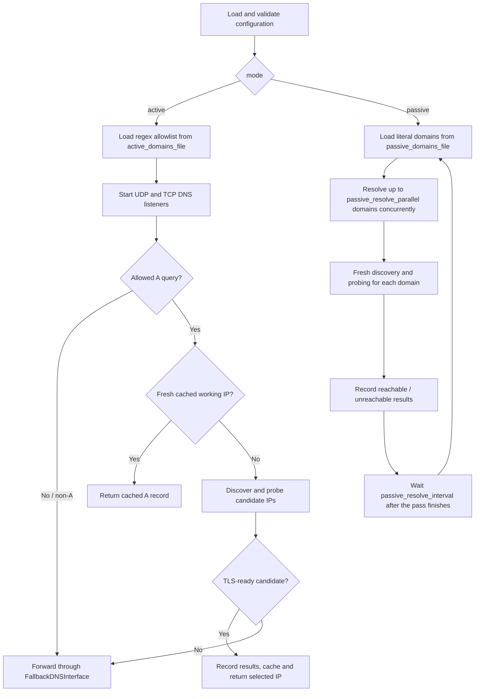

# IPScoutDNS Flowchart

The required `mode` selects one of two workflows:



Both paths query direct resolvers through `DirectDNSInterface` and proxy resolvers through SOCKS5. Direct TCP/TLS probes use `DirectTCPInterface`. ICMP runs after TCP failure and records IP status, but only TLS-ready candidates become selected working domain IPs. Passive mode opens no DNS listeners and never forwards to fallback. Cancellation stops pending domain jobs, in-flight DNS/TLS/ICMP operations, and the interval wait.

The detailed Active request path follows:

```text
IPScoutDNS
├─ Startup
│  ├─ Resolve config path; parse and validate config
│  │  ├─ Invalid config → log fatal error and exit
│  │  └─ Valid config → apply logging settings
│  ├─ Load domain regex filters
│  │  ├─ Invalid regex or read error → log fatal error and exit
│  │  └─ Loaded → create shared DNS handler
│  ├─ Start UDP and TCP listeners
│  │  └─ Listener errors are logged independently
│  └─ Termination signal → shut down both listeners → stop
│
└─ DNS request (shared by UDP and TCP)
   ├─ No question → return SERVFAIL
   ├─ Read first question; normalize domain name
   ├─ Non-A query → forward to fallback DNS
   ├─ A query for disallowed domain → forward to fallback DNS
   └─ Allowed A query
      ├─ Lookup already in flight
      │  ├─ Wait for shared result; success → reply with selected A record
      │  └─ Shared lookup failed → forward to fallback DNS
      └─ Become lookup leader
         ├─ Fresh, valid cache entry → reply with cached A record
         └─ Cache miss
            ├─ Query direct and SOCKS5 resolvers concurrently
            ├─ Keep unique, valid global-unicast IPv4 candidates
            ├─ No candidates → lookup fails
            └─ Test candidates concurrently
               ├─ TCP connection fails
               │  └─ Check ICMP; record IP reachability
               └─ TCP connection succeeds
                  ├─ Record IP as reachable
                  └─ Test TLS handshake
                     ├─ Success → candidate is TLS-ready
                     └─ Failure → candidate is not TLS-ready
                  ├─ Any TLS-ready candidate
                  │  └─ Record each TLS-ready host/domain/IP; cache and reply
                  │     with the first candidate
                  └─ No TLS-ready candidates → delete cache; lookup fails
         ├─ Lookup succeeds → reply with selected A record
         └─ Lookup fails → record domain unreachable; use fallback DNS
            ├─ Fallback query succeeds → return forwarded response
            └─ Fallback query fails → return SERVFAIL
```

## Behavior Notes

- Active mode requires `active_domains_file`. A missing file or invalid regex
  stops startup. An empty file or no matching regex causes A queries to use fallback.
- Non-A queries and disallowed A queries are forwarded unchanged to fallback DNS.
- A successful TCP connection records an IP as reachable, even if TLS fails.
  ICMP is checked only after TCP connection failure.
- The first TLS-ready candidate is returned and cached. If no candidates are
  returned or none are TLS-ready, the lookup fails and the domain is recorded
  unreachable.
- UDP and TCP listener errors are logged independently; one listener failing does not stop startup.
