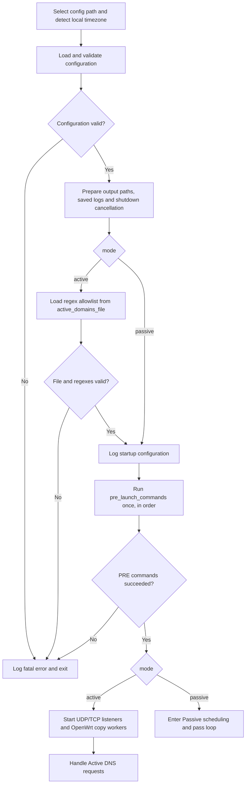
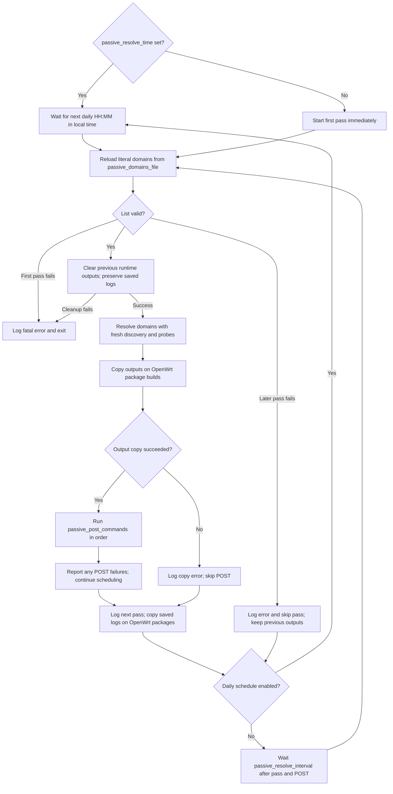
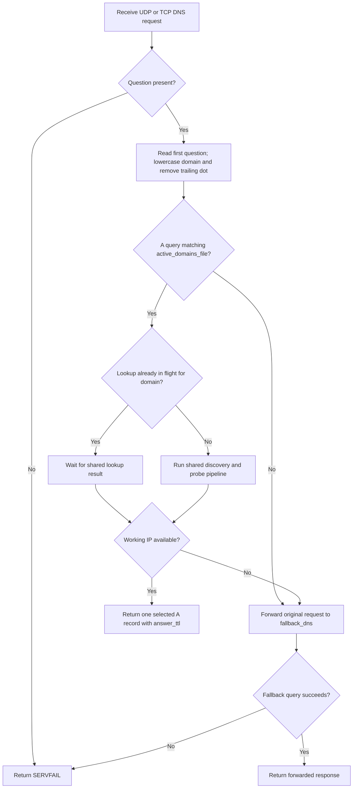
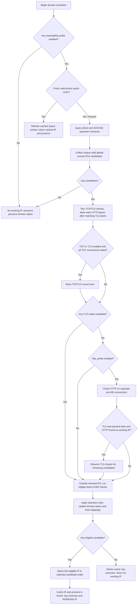
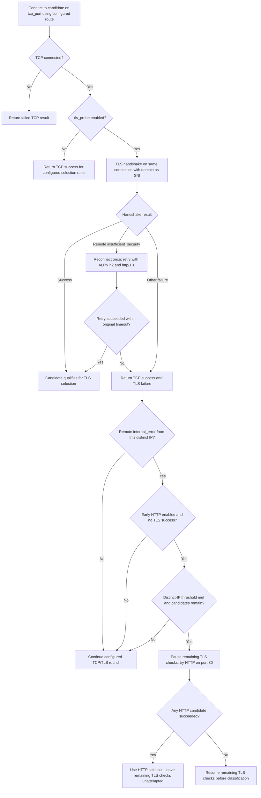

# IPScoutDNS Flowchart

IPScoutDNS filters IPv4 DNS answers using a shared discovery and reachability
pipeline. The required `mode` selects Active DNS serving or scheduled Passive
resolution. This document follows the current implementation in
[main.go](main.go), [resolver.go](resolver.go), [probe.go](probe.go),
[passive.go](passive.go), [commands.go](commands.go), [hosts.go](hosts.go),
[outputs.go](outputs.go), [logging.go](logging.go), and [timezone.go](timezone.go).

## Startup and modes

Config selection checks `--config`, `IPSCOUTDNS_CONFIG` (then the legacy
`IPSELECTOR_CONFIG`), local `config/ipscoutdns.conf`, the legacy local
`ipscoutdns.conf`, and the platform config path. Relative domain-file paths
resolve beside the selected config. In OpenWrt package builds using
`/etc/ipscoutdns.conf`, the default domain filenames resolve under
`/etc/ipscoutdns/`.

PRE hooks run before listeners or Passive scheduling. Commands run sequentially
in separate shells (`cmd.exe` on Windows, `/bin/sh` on Linux/OpenWrt), inheriting
the service's working directory, environment and permissions. Output is
discarded; failures identify the command number. All commands are attempted
unless shutdown cancels the hook. PRE failure stops startup after the list;
empty command lists do nothing.

## Passive scheduling and passes

Passive mode opens no DNS listeners and uses no fallback DNS. Passes do not
overlap, and each pass bypasses the Active cache. `passive_resolve_parallel`
limits concurrent domain jobs. Daily scheduling uses the OS timezone, including
OpenWrt `/etc/TZ`, rechecks the clock every 30 seconds, and skips missed runs.
When `passive_resolve_time` is set, `passive_resolve_interval` is ignored. An
explicit `TZ` environment setting takes precedence; restart after timezone
changes. Forward clock corrections can start one due pass, backward corrections
postpone it, and an attempted local date is not repeated. Missed dates are not
replayed, including dates missed while POST commands run.

Passive inputs are literal hostnames, one per line; regexes, URLs and IP
addresses are rejected. Duplicate hostnames are removed. The file is reloaded
each pass. Skipped or interrupted passes do not run POST. Ordinary Linux and
Windows skip the copying operation and still run POST after a completed pass.
POST failures allow future passes. Saved logs are copied after POST, so they
include its failures and the next-pass message; copy errors are logged without
stopping future passes. Shutdown cancels waits, work and hooks.

## Active DNS request

Concurrent requests for the same allowed domain share one lookup. A fresh, valid
cache entry returns its selected IP and protocol without probing again. `ttl`
controls cache lifetime; `answer_ttl` controls the returned A record's TTL.
Non-A queries and disallowed A queries use fallback. An empty regex allowlist
matches no domains; the supplied `.*` pattern matches every domain. The Active
allowlist is loaded at startup, so changes require a restart. UDP and TCP
listener failures are logged independently; a startup "listening" message
does not establish that the socket bound successfully.

## Shared discovery and probe pipeline

The pipeline below is used by both modes. Active may use the cache; Passive
always performs fresh checks.

TCP/TLS checks are skipped when both switches are disabled. With TLS enabled,
the handshake uses the connection established by the TCP check and sends the
domain as SNI. A remote `insufficient_security` TLS alert triggers one fresh
connection with ALPN `h2` / `http/1.1`, within the original candidate timeout.
The TLS probe checks handshake reachability with certificate verification
disabled.

When TLS and HTTP are enabled, `http_fallback_tls_alerts` can pause TLS after
remote `internal_error` alerts from different IPs, provided no TLS check has
succeeded. Its default is `2`; `0` disables early fallback. HTTP success leaves
remaining TLS candidates untested; if early HTTP fails, TLS resumes.

HTTP sends `HEAD /` with the domain as the Host header to each candidate on
port 80. A valid final response (`200` through `599`, or `101`) counts as
reachable, including redirects and error responses. Redirects are not followed.
HTTP reachability alone does not establish HTTPS compatibility.

### TLS attempt and early HTTP fallback

Timeouts, EOFs and other TLS alerts do not count toward early HTTP fallback.
The alert count resets on each fresh resolution. A total TCP failure retries
the TCP/TLS round once; this is separate from the single-candidate ALPN retry.

### Selection and classification

| Enabled probes | Candidate eligible for DNS selection and `reachable.hosts` |
| --- | --- |
| TLS and HTTP | Successful TCP + TLS handshake, or successful HTTP fallback |
| TLS only | Successful TCP + TLS handshake |
| HTTP only, with or without TCP | Successful HTTP response on port 80 |
| TCP enabled; TLS and HTTP disabled | Successful TCP connection on `tcp_port` |
| ICMP only, direct route | Successful ping |
| All disabled, or ICMP only with proxy route | No eligible candidate |

All four probe switches default to `true`. TLS and HTTP still establish TCP
connections when `tcp_probe=false`. Selection scans candidates in their collected
order; it does not rank IPs by latency. Resolver completion order can change
the collected order between resolutions. HTTP is attempted only when no
TLS-ready candidate was found.

IP reachability and domain eligibility are separate:

- A successful TCP connection on either the configured TCP/TLS port or HTTP
  port 80 records the IP as reachable, even if TLS or HTTP subsequently fails.
- Checked candidates with no successful TCP connection may receive ICMP checks
  when `icmp_probe=true`, the route is direct, and the success limit has not
  been reached. A failed or unavailable ICMP check records these IPs unreachable.
- ICMP can update IP status without making the domain eligible. When TCP is
  enabled and TLS/HTTP are disabled, TCP success is still required for selection.
- A domain is reachable when at least one candidate meets the selection rules;
  completed checks with no eligible candidate record it unreachable.
- No IPv4 candidates, all probes disabled, or cancellation before classification
  leave domain status inconclusive. Active uses fallback when no working IP is
  returned; Passive logs the result without fallback.

### Routes and limits

| Setting | Current behavior |
| --- | --- |
| `direct_dns_interface` | Interface/source IP for direct upstream DNS |
| `proxy_dns_address` | SOCKS5 route for proxy upstream DNS, including HTTPS DoH |
| `fallback_dns_interface` | Interface/source IP for Active fallback forwarding |
| `tcp_route=direct` | Direct TCP/TLS/HTTP and eligible ICMP through `direct_tcp_interface` |
| `tcp_route=proxy` | TCP/TLS/HTTP through `tcp_proxy`; ICMP is skipped |
| `direct_tcp_mark` | Linux/OpenWrt socket mark for direct TCP/TLS/HTTP; `0` disables it |
| `dns_query_parallel` | Global upstream DNS limit across domains and fallback; default `4`, `0` unlimited |
| `parallel_tests` | Concurrent candidate checks per domain; default `16` |
| `passive_resolve_parallel` | Concurrent domain jobs per Passive pass; default `16` |
| `hosts_max_ips_per_domain` | Successful IP / host-mapping limit per domain; default `8`, `0` unlimited |

DNS routing is independent of the probe route. Direct DNS uses plain DNS;
proxy DNS uses DNS-over-TCP or HTTPS DoH through SOCKS5. `dns_timeout` starts
after a query acquires its global slot. `tcp_timeout` bounds each TCP/TLS or HTTP
candidate check. ICMP uses a separate system ping with a one-second reply
timeout and a two-second process deadline. `direct_tcp_mark` preserves source
binding and applies only to direct TCP/TLS/HTTP sockets; DNS, ICMP and SOCKS5
connections are not marked. A marking failure fails the probe. Nonzero marks
are rejected on other operating systems.

The DNS limiter is shared by both modes, all domains and Active fallback.
Queued queries do not spend their network timeout while waiting for a slot;
cancellation stops queued and running queries. A discovery round can therefore
take longer than `dns_timeout`. Domain concurrency, candidate concurrency and
upstream DNS concurrency are separate limits.

Candidate checks run in batches limited by the remaining success quota. Failures
do not consume that quota. Once enough eligible IPs are found, remaining probes
are skipped; untested candidates stay unknown. With a positive host limit, fresh
checks replace that domain's host mappings while preserving other domains;
cache hits retain existing mappings within the limit. With `0`, successful
mappings accumulate without the per-domain cap.

## Outputs, logging, and shutdown

Output config keys choose filenames; the runtime chooses their directory. Blank
optional filenames disable those files.

| File | Contents |
| --- | --- |
| `reachable.hosts` | Eligible mappings as `IP domain`, including HTTP fallback and configured TCP/ICMP-only selection |
| `reachable.domains` / `unreachable.domains` | One classified domain per line |
| `reachable.ips` / `unreachable.ips` | One classified IP per line; TCP or ICMP reachability can differ from domain eligibility |

A later classification removes the same domain/IP from its opposite status
file. Active output files retain results between resolutions; a cache hit does
not revalidate them. Passive clears previous runtime results before each valid
pass, preserving saved logs. On Windows it removes only configured output files
from the shared executable directory.

| Build / platform | Runtime outputs | Saved logs | Persistent copies |
| --- | --- | --- | --- |
| OpenWrt package build | `/tmp/ipscoutdns/` | `/tmp/ipscoutdns/` | Outputs: `/etc/ipscoutdns/outputs/`; logs: `/etc/ipscoutdns/logs/` |
| Regular Linux build | `./outputs/` relative to working directory | `./logs/` relative to working directory | Files stay in their runtime directories |
| Windows | Beside the executable | `logs/` beside the executable | Files stay in their runtime directories |

OpenWrt Active copies outputs on `active_copy_interval` and saved logs separately
on `active_log_copy_interval`, waiting one interval before the first copy.
Passive copies outputs before POST and saved logs afterward.
`save_logs` is independent of runtime console `logs_enabled`; startup/config
messages always appear on the console. `log_max_size` and `log_keep_files`
control saved-log rotation and retention. Rotation keeps whole log messages
intact; OpenWrt package builds retain uncopied logs until a successful copy.
Only builds with `-X main.openWrtPackage=true` use the OpenWrt runtime layout
and copying; a regular Linux build keeps local paths even when run on OpenWrt.

Startup logs show the release version (`dev` for local builds) and detected
timezone. Fresh resolutions with candidates log `collected[N]` unique IPv4
addresses and `reached[N]` eligible host mappings, followed by the selected
`WORKING IP` and protocol (`TLS`, `HTTP`, `TCP` or `ICMP`). These counts describe
discovery and selection, not the total number of probes attempted.

Failed selections show `TCP[] TLS[] HTTP[] ICMP[] NO WORKING IP`: `X` marks an
attempted stage with no success; empty brackets mean success, disabled or not
attempted. Cache hits log `CACHE HIT` with the cached IP and protocol, without
a fresh-resolution summary. Domains with no IPv4 candidates have no result
summary. Resolver, TLS, copy and file-write errors can still appear separately.

A termination signal cancels pending work and schedule waits. Active shuts down
both DNS listeners, waits for copy workers, and attempts a final saved-log copy
on OpenWrt when log saving is enabled.
